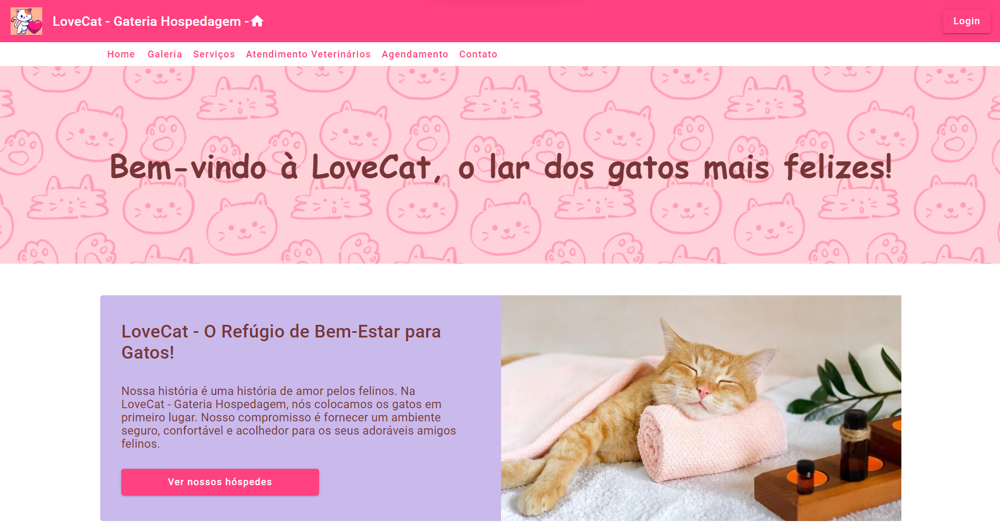

<h1 align="center"> LoveCats</h1>

<p align="center">
Segunda task do módulo de Angular da trilha de front do Vem Ser DBC
</p>

<p align="center">
  <a href="#-tecnologias">Tecnologias</a>&nbsp;&nbsp;&nbsp;|&nbsp;&nbsp;&nbsp;
    <a href="#-instalacao-do-projeto">Instalação do projeto</a>&nbsp;&nbsp;&nbsp;|&nbsp;&nbsp;&nbsp;
  <a href="#-sobre-o-projeto">Sobre o Projeto</a>&nbsp;&nbsp;&nbsp;
</p>

<p align="center">
  
</p>

<p align="center">
  <a href="https://lovecats-ten.vercel.app/" target="_blank">➡️ Acesse o deploy!</a>
</p>

## 🚀 Tecnologias

Esse projeto foi desenvolvido com as seguintes tecnologias:

- Angular
- TypeScript
- Angular Material

## ⚙️ Instalação do projeto

Instalação das dependências:
```
npm install
```

Inicialização da aplicação:
```
ng serve --open
```


## 💻 Sobre o Projeto

LoveCats é uma aplicação para donos de gatos que procuram um lugar para hospedar seus pets. Nela você pode ver uma galeria com fotos dos nossos hóspedes, consultar nossos serviços, ver uma lista com o nome e email dos nossos veterinários, agendar uma estadia e entrar em contato preenchendo um formulário.